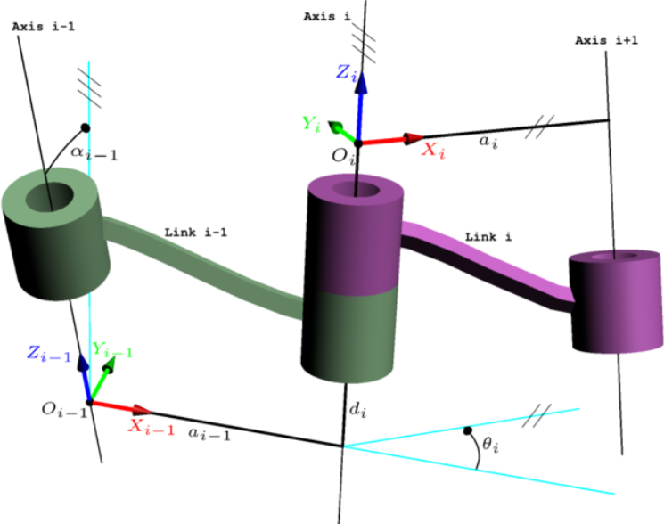
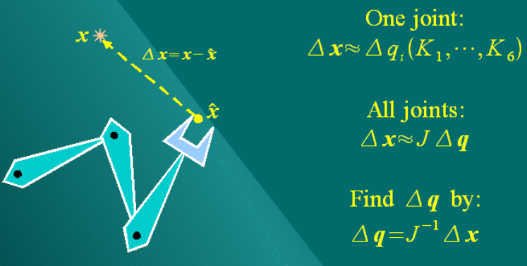
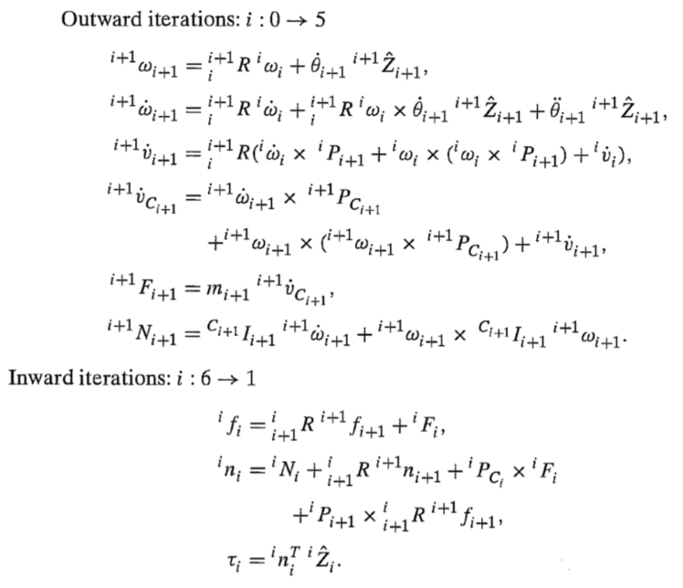
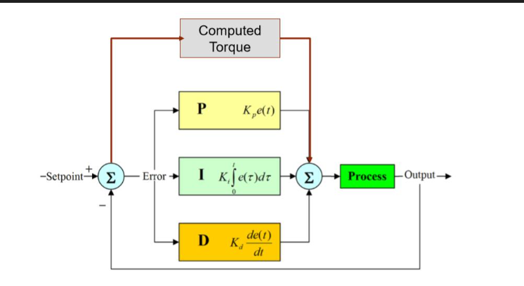

### 1 空间变换

其中齐次变换什么的是机器人学中非常基础和重要的内容。其中需要注意的地方有：

- 熟悉坐标表示方式：坐标系 {B} 在坐标系 {A} 下的位姿为 $${^A_B}T$$ 等；
  
- 左乘与右乘矩阵的区别；

- 了解旋转矩阵每一列的含义，学会如何通过「目测」写出两个坐标系之间的旋转矩阵；
  
- 姿态的表示方式：RPY 角、各种欧拉角、轴角（Angle-Axis）表示、旋转矩阵，除了书上的内容，可以顺便看看四元数（Quaternion）表示,了解欧拉角的 Gimbal lock （知道三参数表示的问题，才能更容易接受四元数这样的新事物）；
  
- 了解一下角速度。

### 2 运动学

对于机器人来说，一个基本工作就是计算运动学：

- 正运动学：根据关节角度，计算机器人工具坐标系（末端）在机器人基座坐标系（底座）下的位姿；
- 逆运动学：给定一个末端位姿，计算达到这个位姿的关节角度。

前面，你知道了可以用一个 4x4 矩阵来描述两个坐标系之间的关系。对于机器人正运动学，如果我们知道每个连杆两两之间的坐标变换，就可以通过矩阵乘法计算出最后的末端位姿了。

为了方便计算两个连杆之间的相对位姿，你就需要学习一个叫做 DH 的建模方法，简而言之，就是按照一定规则建立每个关节坐标系，然后每个坐标系可以用四个参数（DH参数）来确定。

当然， DH 也有好几种，什么 Standard DH， Modified DH 之类的。

1）建立坐标系：

- $$z_i$$ 轴与第 $$i$$ 个关节重合，关节转动方向遵照右手定律；

- $$x_i$$ 平行于 $$z_i$$ 和 $$z_{i+1}$$ 的公垂线：$$x_i = z_i \times z_{i+1}$$。如果两 $$z$$ 轴平行，则让 $$x_i$$ 从 $$z_{i}$$ 指向 $$z_{i+1}$$；

- 有了 $$x$$、 $$z$$ 轴后，就可以用右手定律定义 $$y$$ 轴方向。

- 除了与每个关节固连的坐标系外，还有可能额外在机器人基座 {B} 与末端工具 {E} 上固连两个坐标系。

2）计算 DH 参数:

- $$a_i$$ 是沿着 $$x_i$$，从 $$z_i$$ 到 $$z_{i+1}$$ 的距离；

- $$\alpha_i$$ 是绕着 $$x_i$$，从 $$z_i$$ 到 $$z_{i+1}$$ 的角度；

- $$d_i$$ 是沿着 $$z_i$$，从 $$x_{i-1}$$ 到 $$x_i$$ 的距离；

- $$\theta_i$$ 是绕着 $$z_i$$，从 $$x_{i-1}$$ 到 $$x_i$$ 的角度。

3）计算变换矩阵：

$${^i_{i-1}}T = Rot(x_{i-1}, \alpha_{i-1}) \cdot Trans(x_{i-1},a_{i-1}) \cdot Rot(z_i, \theta_i) \cdot Trans(z_i, d_i)$$

$${^i_{i-1}}T=\begin{bmatrix}cos(\theta_i)&-sin(\theta_i)&0&a_{i-1}\\sin(\theta_i)cos(\alpha_{i-1})&cos(\theta_i)cos(\alpha_{i-1})&-sin(\alpha_{i-1})&-d_isin(\alpha_{i-1})\\sin(\theta_i)sin(\alpha_{i-1})&cos(\theta_i)sin(\alpha_{i-1})&cos(\alpha_{i-1})&d_icos(\alpha_{i-1})\\0&0&0&1\end{bmatrix}$$

4）正解：

$${^b_e}{T}={^b_1}T\cdot{^1_2}T\cdot{...}\cdot{^n_e}T$$

5）逆解：

就是通过不断调整（左乘与右乘）上面几个矩阵的位置，尝试找到可以单独求解的未知数即可。虽然有些繁琐，但是各位初学者一定要亲手推一遍六轴机械臂的运动学逆解公式，并**编程实现**。

### 3 雅可比矩阵

雅可比矩阵 $$J$$ 是机器人学中一个非常重要的东西。它表示机器人关节速度 $$\dot{q}$$ 与末端速度 $$\dot{x}$$ 之间的关系:

$$\dot{x}=J\cdot \dot{q}$$

- 为什么不能直接对欧拉角求导获得速度？；

- 是否可以直接对运动学正解的结果求偏导？

有了雅可比矩阵，你就会发现，你知道怎么通过调节角度来控制末端运动了。这时候我们再回头看运动学逆解的问题。你会发现：「让机器人末端朝着目标位姿运动不就可以了？」。

当然，这个方法很简洁，但是也有它本身的问题：

- 计算速度慢，需要多次迭代；
  
- 一次只能返回一组解；
  
- 可能会遇到奇异点等，结果无法收敛。

这时候，你可以顺便去了解一些奇异（Singularity）的问题，理解奇异性是机器人构形相关的属性，无法通过建模方式来消除。

### 4 动力学

对于多轴机器人的动力学，不论是采用牛顿欧拉还是拉格朗日法，都会**显得**异常复杂。再加上如果之前没学好理论力学，那么基本上是举步维艰了。

先对这个部分有个基本概念就行，暂时不需要直接去碰六轴机器人的动力学：

- 会用拉格朗日法计算三轴机械臂的动力学模型（三轴的求解还是在可接受范围内的）；

- 用牛顿欧拉法计算三轴机械臂的动力学模型，一定要**编程实现**（因为在高自由度情况下，牛顿法更容易通过编程实现，未来如果要做动力学，更可能是用牛顿欧拉、而非拉格朗日）；

- 了解转动惯量之类的物理意义，（在上面编程实现过程中，肯定会有相应的问题发生，如角速度与转动惯量的参考坐标系问题）；

- 大概知道机器人动力学都包含哪些部分（公式的形式、连杆动力学、关节动力学、重力影响、关节摩擦力、电机动力学等）。

###  5 控制

这时候，我们有了各种工具来求解机器人的运动学问题了，我们知道要让机器人到达任意状态的关节角度值。但是，如何让这些关节动起来？

首先，我们要知道，日常生活中的世界还是受牛顿力学统治的。

$$F = m \cdot a$$

要让一个东西动起来，就要给它施力。

如果我们给定一个滑块的运动轨迹 $$s(t)$$，我们就可以计算出它整个轨迹的加速度 $$\ddot{s}(t)$$，进而计算出让滑块按照我们设想运动所需的力 $$F(t) = m \cdot \ddot{s}(t)$$。

换句话说，我们可以通过动力学计算出让机器人运动所需的每个关节力矩。

而关节力矩，可以通过电机提供，对于直流电机，输出力矩与电流成正比。

但是，有几个问题：

- 动力学好难算；

- 动力学参数好不准（转动惯量不好测、关节摩擦力不好算）；

- 还可能有各种外力（抓持的物体，关节动力学属性变化等）。

这就是控制算法的工作了。于是，大家会接触到传说的 PID 控制。

但是，又有问题：如果我们直接把关节目标位置发给 PID 控制器，那么每次都是一次阶跃响应。

这时候你又想到，既然 PID 和动力学都可以计算让机器人运动所需的力，只是动力学稍微有一些不准，那么有没有可能把它们结合在一起，先用动力学算一个基本准确的力矩，然后用 PID 消除不准确性造成的微小误差？

